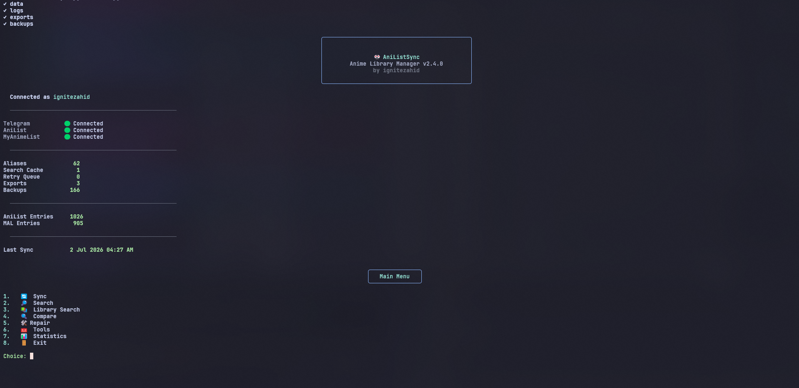
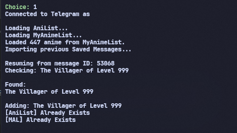

# 🎌 AniListSync

> **Keep your AniList and MyAnimeList libraries synchronized directly from your Telegram Saved Messages.**

AniListSync is a feature-rich command-line anime library manager that scans your Telegram Saved Messages, intelligently matches anime titles, and synchronizes them with **AniList** and **MyAnimeList**.

Designed for large anime libraries, it includes smart search, franchise support, repair utilities, statistics, alias learning, and comprehensive data management.

---

## ✨ Features

### 🔄 Synchronization

* Sync Telegram Saved Messages to **AniList**
* Sync Telegram Saved Messages to **MyAnimeList**
* Resume interrupted imports
* Retry failed imports
* Skip anime already in your library
* Franchise Sync (add related entries together)

### 🔍 Smart Matching

* Interactive search
* Fuzzy title matching
* Automatic alias learning
* Search cache
* Manual alias management
* Intelligent retry queue

### 🛠 Library Management

* Compare Telegram, AniList and MyAnimeList libraries
* Repair missing or unmatched anime
* Statistics dashboard
* Missing anime reports

### 🧰 Tools

The built-in **Tools** menu includes:

* Export
* Import
* Backup
* Restore
* Alias Manager
* Search Cache
* Settings

---

# 📸 Preview

| Main Menu                 | Sync                      |
| ------------------------- | ------------------------- |
|  |  |


---

# 🚀 Installation

Clone the repository:

```bash
git clone https://github.com/ignitezahid/AniListSync.git
cd AniListSync
```

Install the required packages:

```bash
pip install -r requirements.txt
```

Create your configuration file.

### Windows

```bash
copy config.example.py config.py
```

### Linux / macOS

```bash
cp config.example.py config.py
```

Edit `config.py` and add your API credentials.

Run the application:

```bash
python main.py
```

---

# 🔑 Required API Keys

| Service     | Required                  |
| ----------- | ------------------------- |
| Telegram    | API ID & API Hash         |
| AniList     | Access Token              |
| MyAnimeList | Client ID & Client Secret |

Useful links:

* Telegram → https://my.telegram.org/apps
* AniList → https://docs.anilist.co/guide/auth/
* MyAnimeList → https://myanimelist.net/apiconfig

---

# 📋 Main Menu

```text
1. Sync
2. Compare
3. Repair
4. Tools
5. Statistics
6. Exit
```

---

# ⚙️ Settings

AniListSync includes a built-in settings editor.

### Basic Settings

* AniList Sync
* MyAnimeList Sync
* Resume Imports
* Retry Failed Anime
* Auto Learn Aliases
* Franchise Sync
* Search Cache
* Interactive Search
* Automatic Backup

### Advanced Settings

* Search Threshold
* Maximum Search Results
* Maximum Retries
* AniList Page Size
* Stop After
* Stop After Existing
* Default Library Status
* Debug Mode

---

# 📁 Project Structure

```text
AniListSync/

├── backups/
├── data/
├── docs/
├── exports/
├── logs/
├── modes/
├── utils/

├── anilist.py
├── mal.py
├── settings.py
├── sync.py
├── menu.py
├── main.py
└── version.py
```

---

# 🗺️ Roadmap

### Version 2.3

* [ ] Rich terminal interface
* [ ] Cache Manager
* [ ] AniList ↔ MyAnimeList comparison
* [ ] Better export formats

### Version 2.4

* [ ] Duplicate alias detection
* [ ] Improved statistics
* [ ] Batch operations

### Version 3.0

* [ ] Desktop GUI
* [ ] Plugin system
* [ ] Additional anime services

---

# 🔒 Security

Never commit these files:

```text
config.py
telegram_session.session
telegram_session.session-journal
data/mal_tokens.json
```

---

# 🤝 Contributing

Contributions, bug reports, and feature requests are welcome.

If you encounter a bug or have an idea for a new feature, feel free to open an Issue or submit a Pull Request.

---

# 📜 License

MIT License

---

<div align="center">

Made with ❤️ by **ignitezahid**

If you find AniListSync useful, consider giving the repository a ⭐.

</div>
