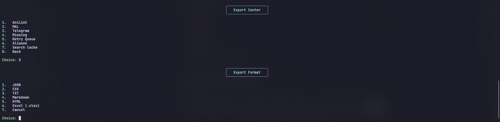
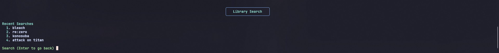
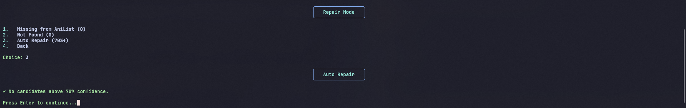
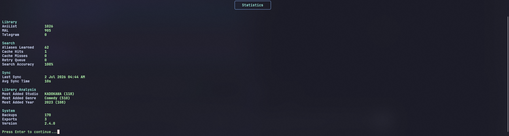
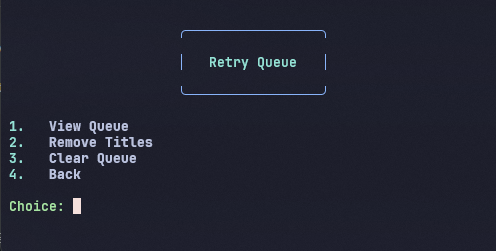
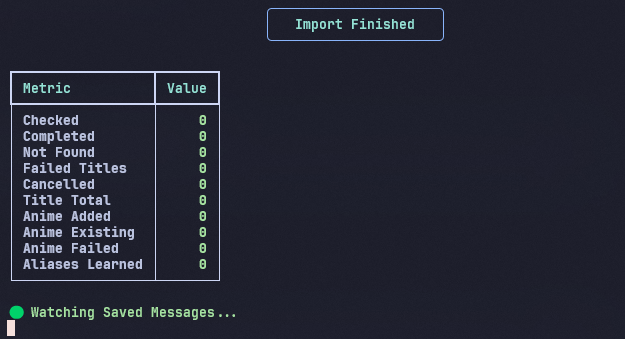

# 🎌 AniListSync

> **Synchronize your AniList and MyAnimeList libraries directly from your Telegram Saved Messages.**

AniListSync is a command-line anime library manager that scans your Telegram Saved Messages, intelligently matches anime titles, and keeps your **AniList** and **MyAnimeList** libraries synchronized.

---

## ✨ Features

- 🔄 Telegram → AniList → MyAnimeList synchronization
- ⚡ Live Telegram monitoring
- 🔎 Manual Search
- 📚 Library Search with status filters & search history
- 🧠 Smart search with fuzzy matching & alias learning
- 📚 Franchise Sync
- 🔁 Retry Queue Manager
- 🗂 Alias Manager with duplicate detection
- 💾 Search Cache
- 🛠 Compare & Auto Repair (70%+ confidence)
- 📊 Enhanced Statistics (cache hits/misses, accuracy, studio/genre/year analysis)
- 💾 Backup, Restore, Import & Export (JSON, CSV, TXT, Markdown, HTML, XLSX)
- ⚙️ Built-in Settings Manager
- 📋 Startup Dashboard with live connection status
- 🎨 Rich terminal interface, progress bars

---

## 📸 Preview

| Main Menu | Sync |
|----------|------|
| |
| |
| |
| |
| |
| |
| |
| |
---

# 🚀 Installation

```bash
git clone https://github.com/ignitezahid/AniListSync.git
cd AniListSync
pip install -r requirements.txt
```

Create your configuration file.

**Windows**

```bash
copy config.example.py config.py
```

**Linux / macOS**

```bash
cp config.example.py config.py
```

Edit **config.py** with your API credentials and run:

```bash
python main.py
```

---

# 🔑 Required API Keys

| Service | Credentials |
|---------|-------------|
| Telegram | API ID & API Hash |
| AniList | Access Token |
| MyAnimeList | Client ID & Client Secret |

- Telegram: https://my.telegram.org/apps
- AniList: https://docs.anilist.co/guide/auth/
- MyAnimeList: https://myanimelist.net/apiconfig

---

# 📋 Dashboard & Main Menu

On startup, a dashboard shows connection status and quick stats before the menu:

```text
╭────────────────────────────────────────────╮
│               🎌 AniListSync               │
│        Anime Library Manager v2.4.0        │
│               by ignitezahid               │
╰────────────────────────────────────────────╯

  Connected as ignitezahid

  ──────────────────────────────────────────────────

Telegram          🟢 Connected
AniList           🟢 Connected
MyAnimeList       🟢 Connected

  ──────────────────────────────────────────────────

Aliases              62
Search Cache          1
Retry Queue           0
Exports               3
Backups             162

  ──────────────────────────────────────────────────

AniList Entries     1026
MAL Entries          905

  ──────────────────────────────────────────────────

Last Sync           1 Jul 2026 08:41 PM
```

```text
1. 🔄 Sync
2. 🔎 Search
3. 📚 Library Search
4. 🔍 Compare
5. 🛠 Repair
6. 🧰 Tools
7. 📊 Statistics
8. 🚪 Exit
```

During sync, a live progress bar tracks import progress:

```text
[████████████░░░░░░░░] 153 / 874
Checking:
Attack on Titan
```

---

# 🧰 Built-in Tools

- Export / Import (JSON, CSV, TXT, Markdown, HTML, XLSX)
- Backup / Restore
- Alias Manager (view, search, edit, merge, delete, detect duplicates)
- Search Cache
- Retry Queue Manager
- Settings (Basic & Advanced)
- Library Search with status filters (Watching, Completed, Planning, Dropped) & search history

---

# 🗺️ Roadmap

### ✅ v2.3

- [x] 🎨 Rich terminal interface
- [x] 🔁 Retry Queue Manager
- [x] 🔎 Manual Search
- [x] 🔄 Live MyAnimeList synchronization
- [x] 🧠 Interactive Search
- [x] 📄 Better export formats
- [x] 📋 Startup dashboard with connection status
- [x] 📊 Enhanced statistics (Exports, Last Sync, Version)
- [x] 📈 Live progress bar during sync
- [x] 💬 Search feedback ("Searching AniList...")

### ✅ v2.4

- [x] 📊 Dashboard 2.0 (connection status, entry counts, cached counts)
- [x] 📚 Library Search with status filters & search history
- [x] 📈 Better Statistics (cache hits/misses, accuracy, studio/genre/year analysis)
- [x] 📄 Better Export (HTML, XLSX)
- [x] 🎨 Better Search (Rich table display)
- [x] 🧠 Duplicate Alias Detection
- [x] 🤖 Auto Repair (70%+ confidence)
- [x] 🕒 Search History (last 5)


## v2.5
- [ ] Smart Library Management
- [ ] Franchise Sync 2.0
- [ ] Bulk Operations
- [ ] Performance Improvements

## v2.6
- [ ] Automation & Scheduled Sync
- [ ] Advanced Analytics
- [ ] Improved Dashboard
- [ ] Quality of Life Improvements

## v2.7
- [ ] Plugin System
- [ ] Custom Themes
- [ ] Enhanced Library Tools
- [ ] Better Export & Reporting

## v2.8
- [ ] Cloud Backup
- [ ] Discord & Telegram Integrations
- [ ] Web Dashboard
- [ ] API Improvements

## v2.9
- [ ] Multi-Profile Support
- [ ] Advanced Customization
- [ ] Collection Management
- [ ] Stability & Optimization

## v3.0
- [ ] Desktop GUI
- [ ] Plugin Marketplace
- [ ] Interactive Analytics
- [ ] Cross-Platform Installer
---

# 🔒 Security

Never commit:

```text
config.py
telegram_session.session
telegram_session.session-journal
data/mal_tokens.json
```

---

# 🤝 Contributing

Contributions, bug reports, and feature requests are always welcome.

---

# 📜 License

MIT License

---

<div align="center">

Made with ❤️ by **ignitezahid**

⭐ If you find AniListSync useful, consider starring the repository.

</div>