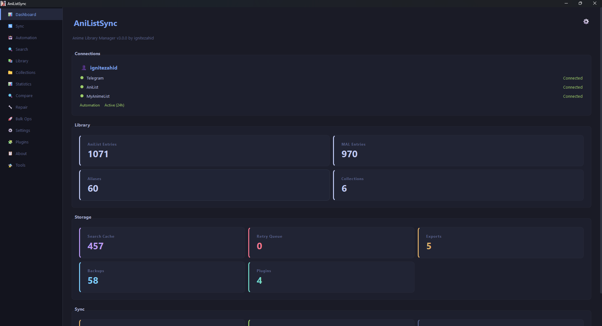
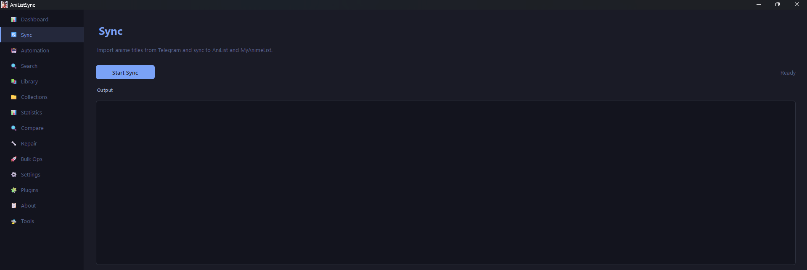
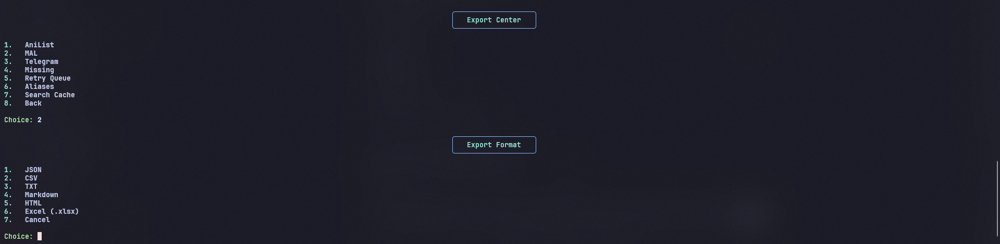
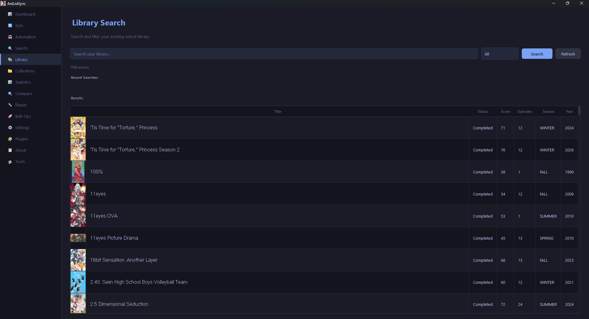
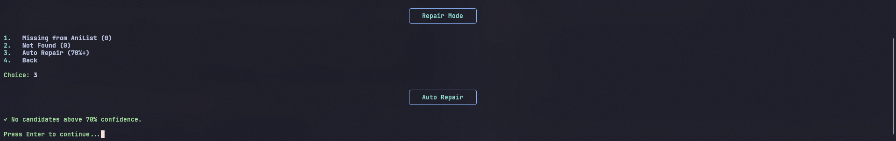
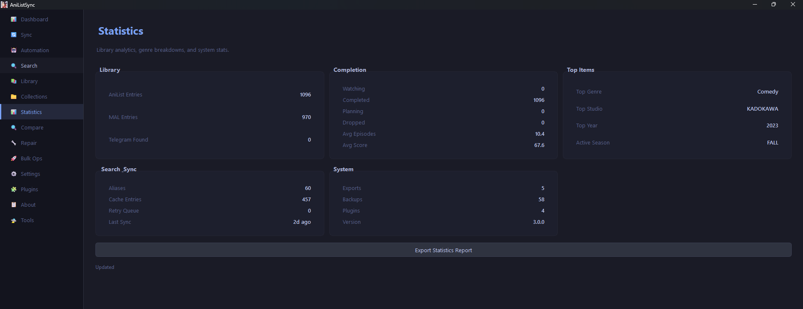
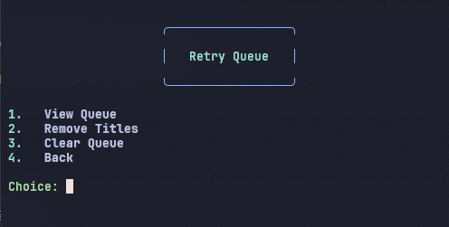
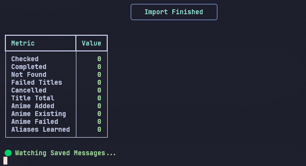

# 🎌 AniListSync

> **Synchronize your AniList and MyAnimeList libraries directly from your Telegram Saved Messages.**

AniListSync is a command-line anime library manager that scans your Telegram Saved Messages, intelligently matches anime titles, and keeps your **AniList** and **MyAnimeList** libraries synchronized.

---

## ✨ Features

- 🤖 Automation & Scheduled Sync (interval config, sync-on-startup, auto backup/health)
- 🔄 Telegram → AniList → MyAnimeList synchronization
- ⚡ Live Telegram monitoring with ESC exit
- 🔎 Manual Search with interactive franchise support
- 📚 Library Search with status filters, search history & fuzzy fallback
- 📁 Collection Manager with stats, sorting, export & custom icons
- 🚀 Bulk Operations (refresh caches, health check, repair, optimize)
- 🧠 Smart search with fuzzy matching & alias learning
- 📺 Recommended watch order in franchise view
- 🔁 Retry Queue Manager
- 🗂 Alias Manager with duplicate detection
- 💾 Search Cache
- 🛠 Compare, Auto Repair (70%+ confidence), Library Health scanner
- 📊 Enhanced Statistics (Completion Analytics, Genre Analytics, exportable reports)
- 💾 Backup, Restore, Import & Export (JSON, CSV, TXT, Markdown, HTML, XLSX)
- ⚙️ Built-in Settings Manager
- 📋 Startup Dashboard 3.0 with card panels, relative time, health score
- 🎨 Rich terminal interface, progress bars

---

## 📸 Preview

| Main Menu | Sync |
|----------|------|
| |
| |
| |
| |
| |
| |
| |
| |
---

# 🚀 Installation

```bash
git clone https://github.com/ignitezahid/AniListSync.git
cd AniListSync
pip install -r requirements.txt
```

Create your configuration file.

**Windows**

```bash
copy config.example.py config.py
```

**Linux / macOS**

```bash
cp config.example.py config.py
```

Edit **config.py** with your API credentials and run:

```bash
python main.py
```

---

# 🔑 Required API Keys

| Service | Credentials |
|---------|-------------|
| Telegram | API ID & API Hash |
| AniList | Access Token |
| MyAnimeList | Client ID & Client Secret |

- Telegram: https://my.telegram.org/apps
- AniList: https://docs.anilist.co/guide/auth/
- MyAnimeList: https://myanimelist.net/apiconfig

---

# 📋 Dashboard & Main Menu

On startup, a dashboard shows connection status, library stats, storage, and sync info in card-style panels:

```text
╭────────────────────────────────────────────╮
│               🎌 AniListSync               │
│        Anime Library Manager v2.6.0        │
│               by ignitezahid               │
╰────────────────────────────────────────────╯

  Connected as ignitezahid

╭─── Connections ────────────────────────────╮
│  Telegram          🟢 Connected              │
│  AniList           🟢 Connected              │
│  MyAnimeList       🟢 Connected              │
│  Automation        🟢 Active (30 min)        │
╰─────────────────────────────────────────────╯

╭─── Library ────────────────────────────────╮
│  AniList Entries   1064                      │
│  MAL Entries       938                       │
│  Aliases           55                        │
│  Collections       3                         │
╰─────────────────────────────────────────────╯

╭─── Storage ────────────────────────────────╮
│  Search Cache      29                        │
│  Retry Queue        0                        │
│  Exports            4                        │
│  Backups            50                       │
╰─────────────────────────────────────────────╯

╭─── Sync ───────────────────────────────────╮
│  Last Sync         3 min ago                 │
│  Next Sync         18h 30m                   │
│  Health            100%                      │
╰─────────────────────────────────────────────╯
```

```text
  1. 🔄  Sync
  2. 🤖  Automation
  3. 🔎  Search
  4. 📚  Library Search
  5. 🗂   Collections
  6. 🔍  Compare
  7. 🛠   Repair
  8. 🧰  Tools
  9. 📊  Statistics
 10. 🚀  Bulk Operations
 11. 🚪  Exit
```

During sync, a live progress bar tracks import progress:

```text
[████████████░░░░░░░░] 153 / 874
Checking:
Attack on Titan
```

---

# 🧰 Built-in Tools

- 🤖 Automation (scheduled sync, sync-on-startup, auto backup, auto health)
- Export / Import (JSON, CSV, TXT, Markdown, HTML, XLSX)
- Backup / Restore
- Alias Manager (view, search, edit, merge, delete, detect duplicates)
- Search Cache
- Retry Queue Manager
- Settings (Basic & Advanced)
- Library Health Scanner (12 grouped checks)
- Library Search with status filters, search history & fuzzy fallback
- Collection Manager (stats, sorting, export, icons)
- Bulk Operations (refresh, repair, optimize)

---

# 🗺️ Roadmap

### ✅ v2.3

- [x] 🎨 Rich terminal interface
- [x] 🔁 Retry Queue Manager
- [x] 🔎 Manual Search
- [x] 🔄 Live MyAnimeList synchronization
- [x] 🧠 Interactive Search
- [x] 📄 Better export formats
- [x] 📋 Startup dashboard with connection status
- [x] 📊 Enhanced statistics (Exports, Last Sync, Version)
- [x] 📈 Live progress bar during sync
- [x] 💬 Search feedback ("Searching AniList...")

### ✅ v2.4

- [x] 📊 Dashboard 2.0 (connection status, entry counts, cached counts)
- [x] 📚 Library Search with status filters & search history
- [x] 📈 Better Statistics (cache hits/misses, accuracy, studio/genre/year analysis)
- [x] 📄 Better Export (HTML, XLSX)
- [x] 🎨 Better Search (Rich table display)
- [x] 🧠 Duplicate Alias Detection
- [x] 🤖 Auto Repair (70%+ confidence)
- [x] 🕒 Search History (last 5)

### ✅ v2.5

- [x] 📁 Collection Manager (stats, sorting, export, icons, search)
- [x] 🚀 Bulk Operations (refresh, health, repair, optimize)
- [x] 📺 Recommended watch order in franchise view
- [x] 🧹 Fuzzy-matching fallback in library search
- [x] 📊 Average score in library data (GraphQL)
- [x] 🛠 Release hardening (ruff cleanup, unused code removal)

### ✅ v2.6

- [x] 🤖 Automation & Scheduled Sync (menu, interval config, sync-on-startup)
- [x] 📊 Statistics 3.0 (Completion Analytics, Genre Analytics, exportable reports)
- [x] 📋 Dashboard 3.0 (card-style panels, relative time, countdown, health score)
- [x] 🔧 Retry queue deduplication (list → set)
- [x] 🧰 Library Health refactored (`_compute_health_score()` reusable for dashboard)
- [x] 💾 State.json written less frequently (every 5th sync, preserves timestamps)
- [x] ⚡ Collection Manager library cache (avoids repeated API calls)
- [x] 🔄 Auto Backup before sync & Auto Health after sync

### v2.7
- [ ] Plugin System
- [ ] Custom Themes
- [ ] Enhanced Library Tools
- [ ] Better Export & Reporting

### v2.8
- [ ] Cloud Backup
- [ ] Discord & Telegram Integrations
- [ ] Web Dashboard
- [ ] API Improvements

### v2.9
- [ ] Multi-Profile Support
- [ ] Advanced Customization
- [ ] Collection Management
- [ ] Stability & Optimization

### v3.0
- [ ] Desktop GUI
- [ ] Plugin Marketplace
- [ ] Interactive Analytics
- [ ] Cross-Platform Installer
---

# 🔒 Security

Never commit:

```text
config.py
telegram_session.session
telegram_session.session-journal
data/mal_tokens.json
```

---

# 🤝 Contributing

Contributions, bug reports, and feature requests are always welcome.

---

# 📜 License

MIT License

---

<div align="center">

Made with ❤️ by **ignitezahid**

⭐ If you find AniListSync useful, consider starring the repository.

</div>
