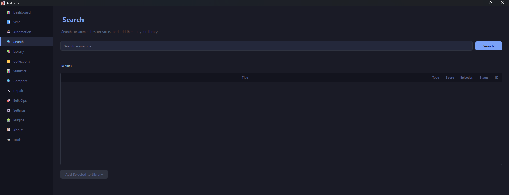
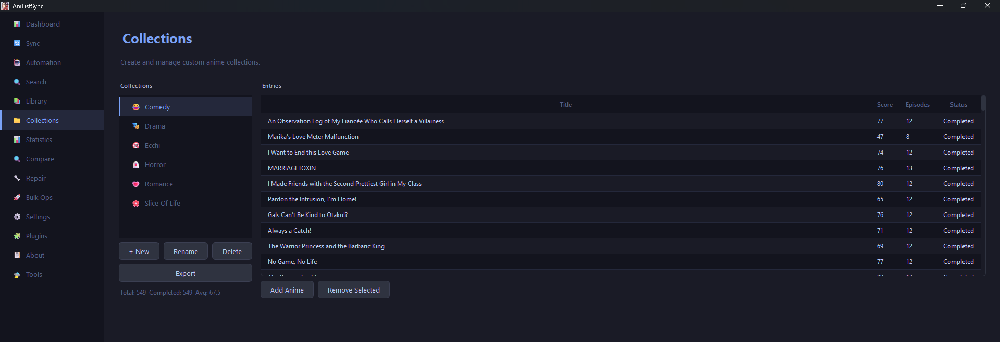
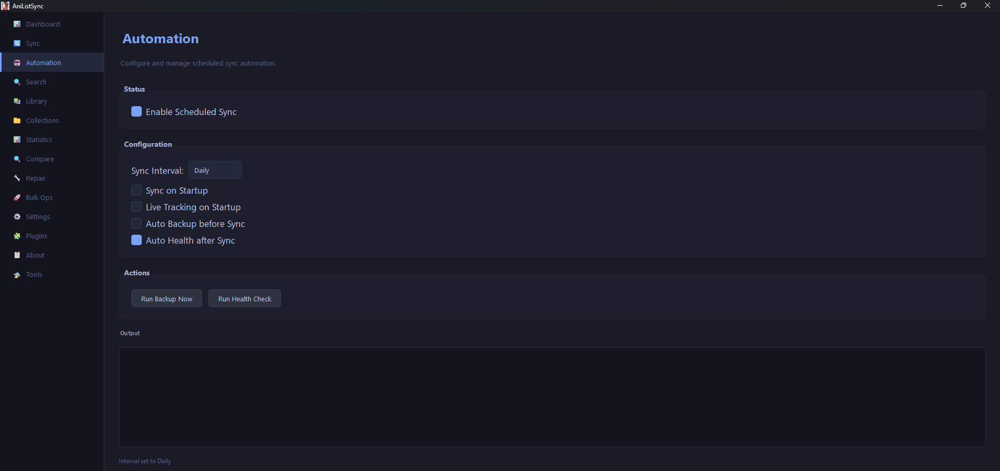

# 🎌 AniListSync

> Desktop GUI + CLI anime library manager — scan Telegram chats, match titles, and sync **AniList** and **MyAnimeList** libraries.

[](https://github.com/ignitezahid/AniListSync/stargazers)
[](LICENSE)
[](https://www.python.org/)
[](https://github.com/ignitezahid/AniListSync/releases)

---

## 📸 Screenshots

| Dashboard | Sync | Library |
|---|---|---|
|  |  |  |
| **Search** | **Statistics** | **Collections** |
|  |  |  |
| **Automation** | | |
|  | | |

---

## 🖥️ Desktop GUI (v3.0)

Launch the graphical interface with the `--gui` flag:

```bash
python main.py --gui
```

Or download the pre-built `AniListSync.exe` from the [Releases](https://github.com/ignitezahid/AniListSync/releases) page — no Python required.

### GUI Features

- 📊 **Card-based Dashboard** — connection status (Telegram/AniList/MAL), library stats, storage metrics, and live sync timeline with relative time
- 🔄 **Sync tab** — import from Telegram, match to AniList, push to MyAnimeList with live progress
- 📚 **Library Search** — filter/sort your AniList library with status filters, cover art thumbnails, and fuzzy search
- 🔎 **Search tab** — manual search with interactive franchise view and watch order
- 📁 **Collections** — create/manage custom collections with stats, sorting, export, and icons
- 📊 **Statistics** — completion analytics, genre breakdown, exportable reports (JSON, CSV, TXT, MD, HTML, XLSX)
- 🔍 **Compare** — compare Telegram titles against your AniList library with interactive candidate selection
- 🛠 **Repair** — fix missing MAL IDs, broken aliases, and data inconsistencies
- 🚀 **Bulk Ops** — refresh caches, rebuild statistics, batch repair
- 🧰 **Tools** — export/import data, backup/restore, library health scanner with one-click auto-fixes
- 🤖 **Automation** — scheduled sync with configurable intervals, sync-on-startup, auto backup and health checks
- ⚙️ **Settings** — configure sync behavior, API credentials, notification toggles, telegram sources
- 🎨 **Light & Dark themes** — switch between pure white and near-black themes
- 🧩 **Plugin Manager** — enable/disable plugins (Discord RPC, notifications, cloud backup, themes)
- 🌈 **Animated splash screen** — branded startup with background initialization
- 🚀 **Instant startup** — splash covers initialization, connection status cached for immediate display

---

## ✨ Features

- 🔄 **Sync Engine** — Telegram → AniList → MyAnimeList with live progress, fuzzy matching, franchise support, retry queue
- 🤖 **Automation** — scheduled sync (configurable interval), sync-on-startup, auto backup/health check
- 🔎 **Search** — manual search with interactive franchise view & watch order; library search with status filters, history & fuzzy fallback
- 📁 **Collections** — create/manage custom collections with stats, sorting, export, icons
- 📊 **Statistics** — completion analytics, genre breakdown, exportable reports (JSON, CSV, TXT, MD, HTML, XLSX)
- 🛠 **Tools** — title comparison, auto repair, library health scanner, import/export, backup/restore
- 🧩 **Plugin System** — Discord RPC, desktop/webhook/Telegram notifications, cloud backup (GitHub Releases / S3 / Google Drive), 7 themes

---

## 🚀 Installation

### Option 1: Pre-built EXE (Windows)

1. Download `AniListSync.exe` from the [latest release](https://github.com/ignitezahid/AniListSync/releases)
2. Run it — no Python required
3. On first run, `config.py` is created at `%APPDATA%\AniListSync\config.py` — open it and fill in your API credentials (see [API Keys](#🔑-api-keys) below)

### Option 2: From Source

```bash
git clone https://github.com/ignitezahid/AniListSync.git
cd AniListSync
pip install -r requirements.txt
copy config.example.py config.py   # Windows
cp config.example.py config.py     # Linux/macOS
```

Edit **config.py** with your API credentials, or run `python main.py` — the first-run wizard will guide you through setup.

### 🔑 API Keys

| Service | Credentials |
|---------|-------------|
| Telegram | [API ID & Hash](https://my.telegram.org/apps) |
| AniList | [Access Token](https://docs.anilist.co/guide/auth/) |
| MyAnimeList | [Client ID & Secret](https://myanimelist.net/apiconfig) |

---

## 🧩 Plugin System

Each plugin lives in `plugins/<name>/` with a `manifest.json` and entry script. Manage them from the **Plugins** sidebar tab in the GUI, or from the CLI Plugin Manager.

- 🎮 **Discord RPC** — Rich Presence with auto-reconnect, custom status text, cross-platform
- 🔔 **Notifications** — desktop toasts + Discord webhook + Telegram push for sync/backup/health/anime additions
- ☁️ **Cloud Backup** — zip + upload to GitHub Releases, Amazon S3 (or compatible), or Google Drive
- 🎨 **Themes** — Dracula, Catppuccin, Nord, Tokyo Night, Solarized Light, Matrix, Gruvbox (+ Light/Dark)

See [`docs/plugins.md`](docs/plugins.md) for the plugin API.

---

## ⌨️ CLI Mode

Run without `--gui` for the classic terminal interface:

```text
  1. 🔄  Sync
  2. 🤖  Automation
  3. 🔎  Search
  4. 📚  Library Search
  5. 🗂   Collections
  6. 📊  Statistics
  7. 🔍  Compare
  8. 🛠   Repair
  9. 🚀  Bulk Operations
 10. 🧩  Plugins
 11. 📋  About
 12. 🧰  Tools
 13. 🚪  Exit
```

---

## 🔒 Security

Never commit: `config.py`, `*.session`, `data/`, `data/mal_tokens.json`

---

## 📜 License

MIT License — Made by **ignitezahid**

⭐ If you find AniListSync useful, consider starring the repository.
